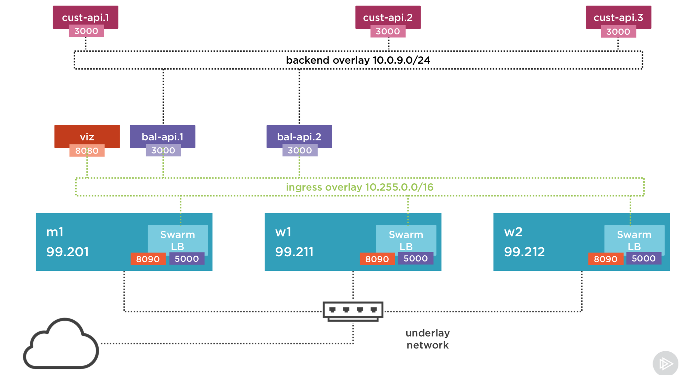
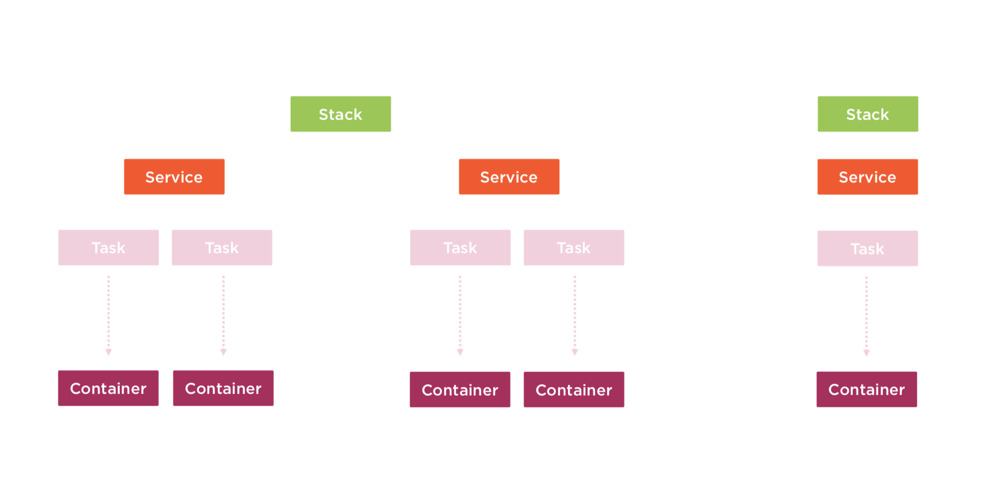

#1. Why Multiple Container Hosts?
**Install containner**

```docker
docker run -rm -d -p 3000:3000 swarmgs/nodewebstress
```

**Basic Load Test**
```bash
ab -n 1000 -c 4 http://127.0.0.1:3000/customer/1
```

A `-c 4` that means send four requests at the same time.
After running this command, you will set a result of load testing. Check `Requests per second` param.

Think about, Optimize API code or run API more than one container.

**Run two instance in same machine**

```docker
docker run --rm -d -p 3001:3000 swarmgs/nodewebstress
```

Install parallel
```
brew install parallel
```

Run load test again.
```
echo "http://127.0.0.1:3000/customer/1\nhttp://127.0.0.1:3001/customer/2" | parallel -j 2 "ab -n 1000 {.}"
```

**Connerns**
- Scale Capaciry
    - Multiple Containers
    - Load Balancing
- Container Failure
    - Restart
        ```
        docker run -d -p 3002:3000 --restart=unless-stoped swarmgs/nodewebstress
        ```

- Node Failuer
    - Redistribute Containers
    - Replace Node
    - Placement
    - Node Maintenance
- Internal Communication
    - Demo
        - Start Customer API
            ```
            docker run --rm -d -p 3000:3000 --name customer-api --restart=unless-stoped swarmgs/nodewebstress
            ```
        - Start Balance API
            ```
            docker run --rm -d -p 4000:3000 --name balance-api -e MYWEB_CUSTOMER_API=192.168.0.10:3000 swarmgs/nodewebstress
            ```
            `-e MYWEB_CUSTOMER_API`  is defined env parameter

- Defined Networks to Container
    - Sharing single address on Node
    - Create new networks
        ```
        docker network create -d=bridge company
        ```
    - Start Container
        ```
        docker run --rm -d --name customer-api --network company swarmgs/customer
        ```
        ```
        docker run --rm -d --name balance-api --network company -p 4000:3000 -e  MYWEB_CUSTOMER_API=customer-api:3000 swarmgs/balance
        ```
- docker-compose.yml
    - See a `company.yml`
    - Run `docker-compose -f c1/company.yml up -d` 
    - Check network `docker network ls`
    - Stop `docker-compose -f company.yml stop customer-api`

#2. Creating a Swarm and Running a Services

**Enable Swarm Mode**
```docker
docker info
```
check `Swarm inactive`

```docker 
docker -v
```
check Management Command

Check Swarm mode
```docker 
docker swarm -h
```

**Swarm init**
``` 
docker swarm init
```

**Docker Node Command**
``` 
docker node -h
docker node inspect self  
```

**_Special Function_**
```
docker service -h
```
vs
```
docker container -h
```

#3. Create Service Create Container
``` 
docker service create --name web --publish 8080:80 nginx
```
`--name web` : service name
`--publish` : enable publish port
`8080:80` : `8080` publish port , `80` binding port

**A Service is a Definition of an Application**
- What you would like to Run?
    - Aeb site
    - Database
    - Customer API
    - Summary : What is the application you would like to Run.
- For example : Web site services
    - image: nginx
    - publish : 8080:80
    - command, workdir, env, vars
    - memory/cpu limits
    - network
    - replicas: 2
    
**Service lead to Task**
- Task to prepare the container
- `docker service ps SERVICE_NAME` to show task ID in column ID

**Remove Service**
- `docker service rm web`    
- Don't do this in production

**Update a Service to Scale the Number of Container**
```
docker service update --replicas=3  web
```
Or
```
docker service scale web=4
```

Check service instance : `docker service ps web` or `docker ps`
Stop Container `docker stop ID`


**Task Scheduling**
- Check a diagram https://docs.docker.com/engine/swarm/how-swarm-mode-works/services/#tasks-and-scheduling

**Create Second Service**
- Create another service `docker service create --name customer-api --publish 3000:3000 swarmgs/customer`
- Check all service `docker service ls`
- Scale down to 
    - web =  2 `docker service scale web=2`
    - customer-api = 2 `docker service scale customer-api=2`
    

**Swarm Mode Routing**
- Check a diagram https://docs.docker.com/engine/swarm/ingress/#publish-a-port-for-a-service
- Can send traffic to any node that not have container running

**Testing Throughput on a Scaled Service**
- Use `ab -n 1000 -c 4 http://127.0.0.1:3000/customer/1`
- Check `Requests per second:    166.29 [#/sec] (mean)`
- Scale up `docker service scale customer-api=4` 
- Check new result `Requests per second:    272.35 [#/sec] (mean)`. this mean double Throughput(Good).
- Solt: 1 CPU = 1 Container

#4. Adding nodes
**Remove node**
- `docker swarm leave --force`. used the `--force` for self node.

**Creating and Managing VMs with docker Machine**

- We have two option for create Node
    - Using Docker Machine
        - `docker-machine create -d virtualbox  m1`
        - `docker-machine env m1`
        - `eval $(docker-machine env m1)`
        - `docker-machine ssh m1`
        - Remove `docker-machine rm m1`
    - Using Vagrant
        - Check docker-swarm-mode-getting-started/Vagrantfile
- Launching 3 VMs with `vagrant up`
    - `vagrant up m1 w1 w2`
    - `vagrant status`
    
- Accessing the Docker Engine In VMs
    - `vargrant ssh m1`
    - `export DOCKER_HOST=192.168.99.201`
    - `docker info | grep Name`
    - `docker ps`
    - `docker images ls`
    
- docker swarm init --advertise-addr command
    - `export DOCKER_HOST=192.168.99.201`
    - `docker swarm init --advertise-addr 192.168.99.201:2377 --listen-addr 192.168.99.201:2377`
    - Check `docker info | grep Swarm`. It shows `Swarm: active`
    - Reference :  [How nodes work](https://docs.docker.com/engine/swarm/how-swarm-mode-works/nodes/)

- Joining workers node
    - `export DOCKER_HOST=192.168.99.211`
    - Join 
        ```docker
        docker swarm join --token SWMTKN-1-2lvpl5x8o812d0iuqud5icrv13q8v62ssc4lsrw2plk43lzujp-8cyjkk81q4n6u6nou0ykaw8ig 192.168.99.201:2377
        ``` 
- Creating a Service to Visualize Our Cluster State
    - Crete _docker-swarm-visualizer container_
        - ```
          docker service create --name viz \
          --publish 8090:8080 \
          --mount=type=bind,src=/var/run/docker.sock,dst=/var/run/docker.sock \
          --constraint=node.role==manager \
           dockersamples/visualizer
           ```
        - `docker service ls`
        - `docker service ps viz`
        - `open http://192.168.99.201:8090/`. Can not uses localhost
- What happen when a Node shutdown.
    - Check Node Down `docker node ls | grep Down`
    - Check viz `open http://192.168.99.201:8090/`
    - Example. Remove a Node
        - `export DOCKER_HOST=192.168.99.212 `
        - `docker swarm leave`
        - `docker node rm w2`
    - Re-Joining Node
        - `docker swarm join-token worker`
        - `export DOCKER_HOST=192.168.99.212`
        - `docker swarm join --token SWMTKN-1-2lvpl5x8o812d0iuqud5icrv13q8v62ssc4lsrw2plk43lzujp-8cyjkk81q4n6u6nou0ykaw8ig 192.168.99.201:2377`

- Creating and Scaling service
    - `export DOCKER_HOST=192.168.99.201`
    - `docker pull  swarmgs/customer`
    - ```
      docker service create --name customer-api \
      --publish 3000:3000 \
      swarmgs/customer
      ```
    -  Scale: `docker service scale customer-api=2`
    -  Scale: `docker service scale customer-api=3`
- Spread Strategy and Test Throughput of Scale service
    - `open http://192.168.99.201:3000/customer/1`
    - Scale up to 3 container `docker service scale customer-api=3`
    - Load Test 
        - Scale down to 1 container `docker service scale customer-api=1`
        - `ab -n 1000 -c 4 http://192.168.99.201:3000/customer/1`
        - Review `Requests per second:    88.51 [#/sec] (mean)`
        - Scale up to 4 container `docker service scale customer-api=4`
        - Review `Requests per second:    271.03 [#/sec] (mean)`

- Inspecting Nodes and Clustering Gotchas
    - `docker node ls` list of the node
    - `docker node inspect w2` 
        - Ip address
        - OS
        - Resource CPU, MEM        
    - Test scale down to 1 `docker service scale customer-api=1`
        - `m1` has viz task
        - `w1` has customer-api task
        - `w2` has note any task
    - `docker ps` : show only container on self node.
    - `docker network ls` : check `ingress`
    - `docker network inspect ingress` : show self node network info. we using peer node.
    
- List Task per Nodes(If not install `viz`)
    - `docker node ps m1` : check all task running on `m1` node.
    - `docker node ps m1 w1 w2`   
- Promoting a Worker to a Manager 
    - `docker node promote w2`. `w2` 's Manager Status will change to Manager `Reachable`. It use full for some to bing manager online quickly.
    - `docker node demote w2`

- Draining a Node to Perform Maintenance
    - Check command `docker node update -h`
    - Use case : update `w1`
        - `docker node update --availability=drain w1` It will move task to another node. So we can update path etc.
        - `docker node update --availability=active w1` The task will not re-balance.
        - Re-Balance
            - `docker service scale customer-api=2`
            - `docker service scale customer-api=1`
- One Container per Node with Global Services
    - By default mode is replicated but we have difference type of mode.   
    - Use Case : Installing `cAdvisor` to every node.
        - [cAdvisor Installation Guid](https://blog.codeship.com/monitoring-docker-containers-with-elasticsearch-and-cadvisor/)
        - ```
            docker service create --mode=global --name cadvisor\
            --mount type=bind,source=/,target=/rootfs,readonly=true \
            --mount type=bind,source=/var/run,target=/var/run,readonly=false \
            --mount type=bind,source=/sys,target=/sys,readonly=true \
            --mount type=bind,source=/var/lib/docker/,target=/var/lib/docker,readonly=true \
            google/cadvisor:latest 
          ``` 
- Swarm Mode in incredibly Easy to Setup
    - [SwarmKit](https://github.com/docker/swarmkit)


#5. Ingress Routing and Publish Ports
**Published ports Provide External Access to Services**
- Swarm load balancing work behind the scene.

**Ingress Overlay Network**
- Ingress Overlay network is a technical that Swarm Load Balancer.
- There are run across between Nodes.
- `docker network ls`. See name `ingress`
- `docker network inspect ingress` to inspecting a detail of ingress network.By default subnet `10.255.0.0/16`

**Options to routing External Traffic to Nodes**
- Set up DNS 
    - Server to routing traffic to one Node but If node down we cloud have a problem.
    - We can Set  round-robin DNS or set up multiple ID for a given domain
- External LB
    - Create one IP Address for LB set out site swarms
    - LB will route available node
    - In case create new Node we will update external LB

**Ingress publish Mode Routes to a Random Cluster**
- Publish cAdvisor on 8080 port
    - Command
    ```
        docker service create --mode=global --name cadvisor\
        --mount type=bind,source=/,target=/rootfs,readonly=true \
        --mount type=bind,source=/var/run,target=/var/run,readonly=false \
        --mount type=bind,source=/sys,target=/sys,readonly=true \
        --mount type=bind,source=/var/lib/docker/,target=/var/lib/docker,readonly=true \
        --publish 8080:8080 \
        google/cadvisor:latest 
        
    ```
    - `open http://192.168.99.201:8080` It will random node. So we can't monitor a specific node.
    
**Remove a published port on an external Service**
- `docker service inspect cadvisor`. Check `Ports` and See `"PublishMode": "ingress"`
- `docker service update --publish-rm 8080 cadvisor`
- `docker service inspect cadvisor` It still ingress network

**Adding a Host Mode Published Port**
- `docker service update --publish-add mode=host,published=8080,target=8080 cadvisor`
- `docker service inspect cadvisor` It show `"PublishMode": "host"`
- `open http://192.168.99.201:8080` for `m1`
- `open http://192.168.99.211:8080` for  `w1`

**Publishing a random ports**
- Create new Service with random ports
    - `docker service create --name nginx-random -p target=80 nginx`
    - Check the random ports `docker service inspect nginx-random | grep PublishedPort`

#6. Reconciling a Desired State
**Quiz- What happen when we add a Node to the Swarm?**
- Join New Node step
    - `vagrant up w3`
    - `docker swarm join-token worker`
    - `export DOCKER_HOST=192.168.99.213`
    -  ```
        docker swarm join --token SWMTKN-1-2lvpl5x8o812d0iuqud5icrv13q8v62ssc4lsrw2plk43lzujp-8cyjkk81q4n6u6nou0ykaw8ig 192.168.99.201:2377
        ```

**Creating a Pending Service and Inspecting**
- Run container with specific node  `docker service create --name onw4 -p 9000:80 --constraint node.hostname==w3 nginx`
- It work fine.
- If Run container with specific node  `docker service create --name onw5 -p 9000:80 --constraint node.hostname==w4 nginx`
    - `w4` node not created yet.
    - If we use `docker service ps onw5`. It shows pending.
    - Or use `docker inspect ID` command. Status also pending.`message` node shows more infomate
    
**Joining a New Node to Fulfill a Pending Service**
- Create new `w4` server and join to the node.
- `docker service ps onw5 `
- `docker service inspect onw5 --pretty`

**What happen to a Service When we lose the Only Compatible Node?**
- Use Case : Shutdown `w4` node
    - `vagrant destroy -f w4`
    - `docker service ls`
    - We will up node Asap.

**Cleaning up Nodes that have Failed**
- `docker node rm w4`. This can use only the node that not have container in site.

**Remove Vestigial Service**
- `docker service rm onw5`

**If Your app fails Then the corresponding Task will be shutdown**
- Use Case : 
    - `docker service create --name exploder -p 9001:3000 swarmgs/nodewebstress`. This image have a API to terminating a Application.
    - `docker service ps exploder`
    - Swarm will shutdown container and create new task automatically( Not guarantee running on same node)
    
**Scale a Service to Zero to Stop it Without Removing It** 
- `docker service scale exploder=0`   

#7. Rolling Update
**Updates Seem to Happen all at Once**
- Create pay Service 
    - `docker service create --name pay --publish 6000:3000 swarmgs/payroll:1`
    - `docker service scale pay=3`
- Update Version
    - `docker service update --image swarmgs/payroll:2 pay`
- Update Version with Delay
    - `docker service update --image swarmgs/payroll:3 --update-delay=30s --update-parallelism=2 pay`
    - `--update-delay=30s` mean delay 30s for next update.
    - `--update-parallelism=2` each update path 2 container

- Using watch vs update in a Terminal
    - `watch` command
    - `watch docker serivce ls pay`
    - `watch docker service ps pay`
    - ./monitoring.sh is useful
- RollOut Mode and Other update Setting are WIP
    - `swarmkit` use `START_FIRST` options
    - `UpdateConfig`
        - `docker service inspect pay`
            - `"Monitor": 5000000000,`
            - `"Parallelism": 1`
            - This params will change when `--update-delay=30s --update-parallelism=2`
            
         - We have new option `--update-failure-action=push`
         - `Veriosn : Index` value will change when use `docker service update`
         
- Inspecting Task Error.
    - `docker service ps `
    - `docker service inspect <ID>` to see detail.
- Rollback to Previous version
    - `docker service uddate --rollback pay` but just rollback only 1 version.
    - We also use `--update-failure-action=rollback` rollout tasks
- Use `--force` to Test Changes to Update Policies
    - Don't care any thing just create save previous configuration
    - `docker service update --force pay`

- Simulate and Monitoring update failure
    - `watch -d -n 0.5 "docker service inspect pay | jq .[].UpdateStatus"`
        - This command is working only `docker service update ` command.
    - `docker service update --update-monitor=1m --update-parallelism=2 --update-delay=20s --image swarmgs/payroll:2 pay`
    - `"State": "paused"`
- Resuming a Paused Update
    - `docker service update pay`
#8. Container to Container Network

- User -> Swarm LB -> bal-api.X2 -> Internal LB -> cust-api.X3

**Ingress Network is Special Purpose for Publish**
- `docker network ls` check ingress network
- `docker network create -h` command for create

**Our new Network Topology**



- create backend overlay network
    - `docker network create -d overlay --subnet=10.0.9.0/24 backend`
        - subnet will depend on internal network. In this case vagrant is using `10.0.2.0/24`. So we can't use `10.0.2.0/24`.
    - `docker network ls` to check new `backend` network
        - DRIVER : `overlay`
        - SCOPE : `swarm`
- Inspect Network
    - `docker network inspect backend`  
    
- Attaching a New Service to Out Overlay Network
    - ```
        docker service create --name balance \
        -p 5000:3000 \
        --network backend \
        swarmgs/balance
      ```
    - `docker service ls` check ports
    - `open http://192.168.99.201:5000/balance/1`. It will error because it require customer-api
- Add a Second Service
    - ```
        docker service create  --name customer \
        --network backend \
        swarmgs/customer
      ```
    - `open http://192.168.99.201:5000/balance/1`. It still error.
- View Logs
    - `docker service logs balance` show `Using CUSTOMER_API = http://localhost:3000`
- Adding an Environment variable 
    - start monitoring `.monitoring.sh balance`
    - `docker service update --env-add MYWEB_CUSTOMER_API=customer:3000 balance`
    - `open http://192.168.99.201:5000/balance/1` should be work.
    
- Docker exec to check service discovery on the Overlay Network
    - `docker service ps balance` check the NODE `w3`
    - `export DOCKER_HOST=192.168.99.213`
    - `docker ps`
    - `docker exec -it CONTAINERID bash`
    - `dig customer` to check IP Address match with subnet IP
- Spelunking Service Container as We Scale Service
    - `monitor.sh customer`
    - `docker service scale customer=6`
    - `docker exec -it CONTAINERID bash`
    - `dig tasks.customer` Now we get all ip of customer service
- Using CURL to validate internal load balance
    - `curl 10.0.9.18:3000/inspect` . We need to provide `/inspect` route
        - Result 
            ```
            Request: 10.0.9.18:3000
            Local Address: 10.0.9.18
            Local Port: 3000
            Remote Address: 10.0.9.11
            Remote Family: IPv4
            Remote Port: 33850
            Bytes Read: 85
            Bytes Written: 0 
            ```
    - `Local Address ` will change every time we send the request. this is a LB logic.
    - `watch -d -n 1 curl 10.0.9.8:3000/inspect`
- Validate External Load Balance
    - `open http://192.168.99.201:5000/inspect`. The Local Address is `10.255.0.45`. This is an ingress Network.
        - From the browser Local Address tasks a lot time to change.
        - `curl http://192.168.99.201:5000/inspect`

- docker service inspect for Finding the Virtual IPs for a Service
    - `docker service inspect balance`. `VirtualIPs` shows two node.
    - `docker service inspect customer`. `VirtualIPs` shows only node because of the customer service not public to external load balance

- Use DNS Round Robin Instead of a Virtual IP
    - `docker service inspect customer`. Check `EndpointSpec.Mode` is `vip`
    - Change mode to dnsrr
        - `docker service update --endpoint-mode=dnsrr customer` 
        - This mean we removed internal LB. 
            - This good for performance or Not use build-in IPVs load balance
- Networks are Lazily to Worker Node


#9. Deploy with Stacks 
- Remove all service `docker service remove SERVICE_NAME` 
    - Back up 
        - `docker service inspect viz > viz.inspect.json`    
        - `docker service inspect customer > customer.inspect.json`    
        - `docker service inspect balance > balance.inspect.json`    
        - `docker network inspect backend > network.backend.inspect.json`    
    - Remove Service
        - `docker service rm viz balance customer`
    - Network
        - `docker network rm backend`
- Create Compose file

     
    - `services/viz.yml`
      ```yaml
        version: '3.1'
        
        services:
          viz:
            image: dockersamples/visualizer
            volumes:
              - "/var/run/docker.sock:/var/run/docker.sock"
            deploy:
              placement:
                constraints:
                  - node.role=manager
        ```
    - `export DOCKER_HOST=192.168.99.201 `
    - `docker stack deploy -c ./services/viz.yml viz`
    - To Check
        - `docker network ls`
        - `docker service ls`
        - `docker service ps viz_viz`
        - `docker stack ls`
        - `docker stack services viz`
- Update a Service with a Stack is as Easy as Creating it 
    - Update `viz.yml`
    - Re-Run `docker stack deploy -c viz.yml viz`   
    - `docker stack services viz`
    - `docker stack ps viz`    
- Remove Stack
    - `docker stack rm viz`        

- Create and Deploy Multi Service Stack
    - create `services/apis.yml`
    - ```yaml
      version: '3.1'
      
      services:
        customer:
          image: swarmgs/customer
        balance:  
          image: swarmgs/balance
          ports:
            - "5000:3000"
          environment:
            MYWEB_CUSTOMER_API: "customer:3000"
      ```
    - `docker stack services apis`
    - `docker stack ps apis` all tasks in service 
    - `docker service ls` all service
    - `docker service ps apis_balance`
    - `docker service ps apis_customer`

- Specifying Replicas in Compose file
    - Update apis.yml
    - ```yaml
      version: '3.1'
      
      services:
        customer:
          image: swarmgs/customer
          deploy:
            replicas: 5
        balance:  
          image: swarmgs/balance
          deploy:
            replicas: 2
          ports:
            - "5000:3000"
          environment:
            MYWEB_CUSTOMER_API: "customer:3000"
      ```
- Docker Command
    - Docker Build Service
        - `docker run`
        - `docker service create`
    - Docker Deploy
        - `docker-compose`
        - `docker stack deploy` Use for docker swarm
- Deploy Element
    - ```yaml
        deploy:
          replicas: 6
          update_config:
            parallelism: 2
            delay: 10s
          restart_policy:
            condition: on-failure
          resources:
            limits:
              cpus: '0.50'
              memory: 50M
            reservations:
              cpus: '0.25'
              memory: 20M
        ```   

#10. Health Checking
- Deploy a Cowsay Stack
    - Create cowsay.yml
    - `docker pull swarmgs/cowsay`
    - `docker stack deploy -c cowsay.yml cow`
    - `open http://192.168.99.201:7000`

- Use Case : What happen If we break a container
    - Application error but container still run. Docker can't catch this case
    - `docker exec -it $(docker ps -f name=cow -q) bash`
    - Make an Application Broke `mv /usr/games/fortune /usr/games/fortune2`
- Automatic Service Recovery with Heath check
    - Create new `cowsayhealth.yml`
    - `docker stack deploy -c cowsayhealth.yml cowsayhealth`
    - `docker exec -it $(docker ps -f name=cowsayhealth -q) bash`
    - Make an Application Broke `mv /usr/games/fortune /usr/games/fortune2` 
    - Application gonna recovery automatically
- Manual forcing a Corrupted Service to Restart
    - Restart Service 
        - `docker service update --force calc_calc`
        
- Option for Adding Health Checks
    - ```docker
      healthcheck:
        test: curl -f -s -S http://localhost/calc/iseverythingok || exit 1
        interval: 5s
        timeout: 5s
        # retries: 3
      ```
    - `docker stack deploy -c calc.yml calc`
    - `docker ps -f name=calc`
    - `docker inspect CONTAINER_ID | jq '.[].State'`
        - See the Node 
           - `FailingStreak:`
           - `Status: healhty`
- Monitoring When Testing Health Checks
    - Use the `monitor-health.sh` file to monitor state of service when service show failure

- Health Checks Prevent Traffic to a Container That is String
    - `watch -d -n 0.5 docker exec $(docker ps -f name=calc_calc.4) dig tasks.calc_calc`. Watch individual IP calc_calc.4
- Health Checking with docker run (Out site Docker Swarm mode)
    - Back to traditional `docker run`
        - `docker stack rm calc`
        - ```
            docker run --rm -p 7000:80 \
            --health-cmd "curl -f -s -S http://localhost/calc/iseverythingok || exit 1" \
            --health-interval=5s \
            swarmgs/calc
           ```
- Adding Health Check to a Dockerfile
    - Check `Dockerfile.health`
- Disable Health Check
    - compose file use 
      ```
      healthcheck: 
        disable: true
      ```
#11. Protect Secrets 
- Creating a secret fi a MySQL Password
    - `docker secret --h`
    - `echo super_secret_password | docker secret create mysql_root_passwd -`
    - `docker secret ls`
- Granting a Service Access to a Secret
    - ```
        version: '3.1'
        
        services:
            mysql:
                image: mysql
                environment: 
                    MYSQL_USER: wordpress
                    MYSQL_DATABASE: wordpress
                    #MYSQL_ROOT_PASSWORD: root
                secrets:
                    - mysql_root_password
        
                deploy:
                    placement:
                        constraints:
                            - node.role==manager
        secrets:
            mysql_root_password:
                external: true
      ```
    - `docker stack deploy -c ./services/mysql_with_secret.yml mysql` The service error.
    - `docker stack ps mysql`
    - `docker service logs mysql_mysql`
    - Edit `mysql_with_secret.yml`
        `MYSQL_ALLOW_EMPTY_PASSWORD: "yes"`
    - `docker stack deploy -c ./services/mysql_with_secret.yml mysql`
    - `open http://192.168.99.201:8090/`
    - `docker exec -it $(docker ps -f name=mysql_mysql -q) bash`
    - `cat /run/secrets/mysql_root_pass`
   
- Using the secret file
    - Update `./services/mysql_with_secret.yml`
        - `MYSQL_ROOT_PASSWORD_FILE: "/run/secrets/mysql_root_pass"`  
        - `docker stack deploy -c ./services/mysql_with_secret.yml mysql`
        - `docker service logs mysql_mysql`
        - `docker ps`
        - `docker exec -it $(docker ps -f name=mysql_mysql -q) bash`
        - `cat /run/secret/mysql_root_password`
        - `mysql -uroot -p`
  
- Step to use Secrets
    1. Create Secrets
        - Password, SSH key, certificates
        - <=500KB
        - Swarm only
        - Storage: encrypted, Replicated Raft log
        - STDIN or file ( compose file v3 )
    2. Grant access to service
        - `docker service create -secret X`
        - stack compose file - secrets section
    3. App reads secret from /run/serects/X
        - in-memory filesystem ( To make persist files by `docker commit`)
        
- _File image secrets Convention
    - Create multi secret for each application
        -  `echo super_secret_password_v1 | docker secret create mysql_root_passwd_v1 -`        
        -  `echo super_secret_password_v2 | docker secret create mysql_root_passwd_v2 -`        
        - Update 'mysql_with_secret.yml'
            ```docker
            version: '3.1'
            
            services:
                mysql:
                    image: mysql
                    environment:
                        MYSQL_USER: wordpress
                        MYSQL_DATABASE: wordpress
                        #MYSQL_ROOT_PASSWORD: root
                        MYSQL_ALLOW_EMPTY_PASSWORD: "yes"
                        MYSQL_ROOT_PASSWORD_FILE: "/run/secrets/mysql_root_pass"
                    secrets:
                        - source: mysql_root_passwd_v2
                          target: mysql_root_pass
                    deploy:
                        placement:
                            constraints:
                                - node.role==manager
            secrets:
                mysql_root_passwd_v2:
                    external: true
            ```